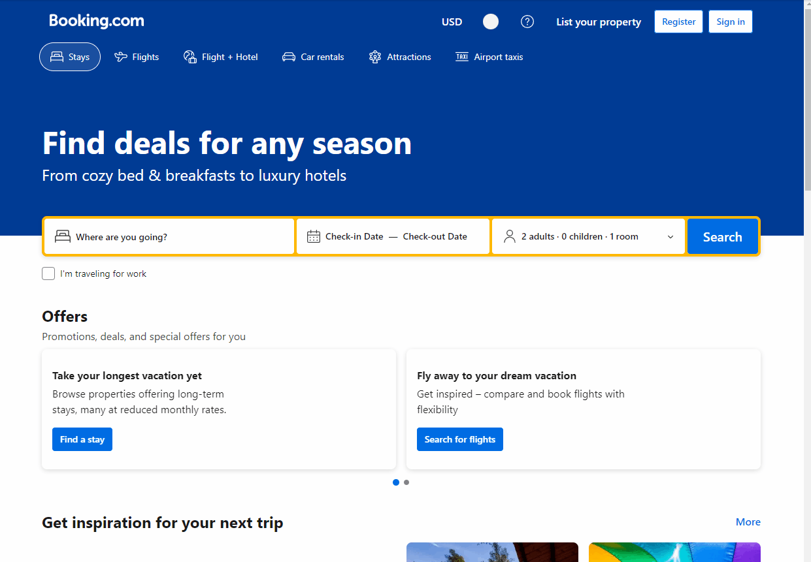
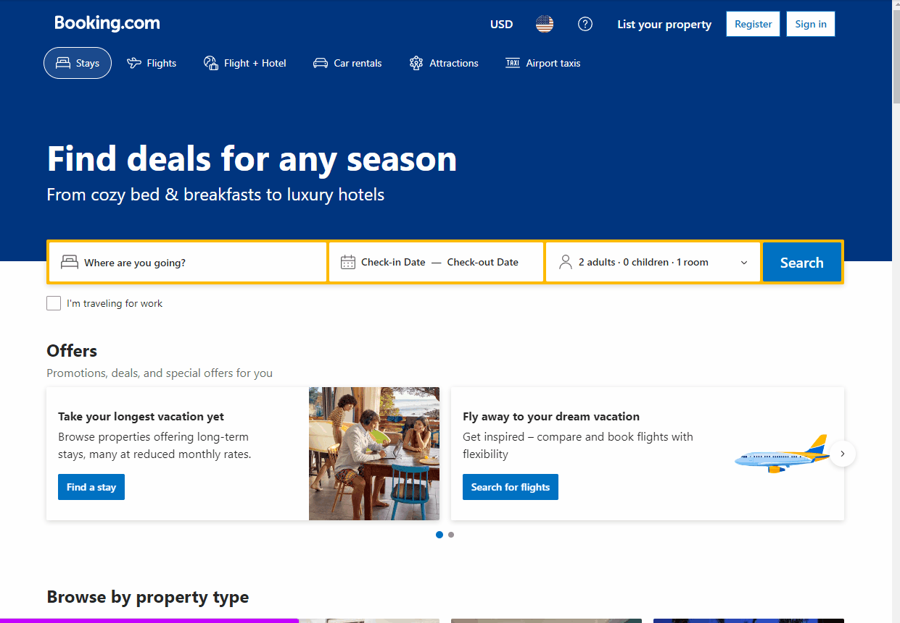

# Vacation Booking Automated Sctipt 🤖

This is a Python program utilizing Selenium WebDriver to automate the process you would take in order to book a vacation on the Booking.com website. Following Object Oriented Programming principles the Booking class is created and instatiated [here](run.py) as "bot", multiple methods were then created and called on "bot"; methods found [here](booking/booking.py).

## Method Breakdown

**.land_first_page()**

it should:

- open up the Booking.com website ☑️
- close the "Genius" popup ☑️

```
    def land_first_page(self):
        # open URL
        self.get(const.BASE_URL)
        # close popup
        # make sure a presence of a pop up is located
        if wait.until(
            EC.presence_of_element_located(
                # element filtration
                (By.CLASS_NAME, "[class_name]"),
            )
        ):
            # grab popup element close button when available
            closeBtn = self.find_element(
                By.CLASS_NAME,
                "[class_name]",
            )
            # close popup
            closeBtn.click()
```



**.change_currency()**

it should:

- click on currency selection modal ☑️
- click on currency given in parameter ⛔
  - <span style="color:red">ERROR:</span> complied style sheets makes it difficult to filter currencies by name.

```
    # change website currency for universal
    def change_currency(self, currency):
        # grabbing currency modal element
        currencyElement = self.find_element(
            By.CSS_SELECTOR, '[css_selector]'
        )
        # click on currency modal
        currencyElement.click()
        # Selecting span by filtering out by span based on currency param
        currencyText = self.find_elements(By.CLASS_NAME, "[class_name]")
        # loop through all currencies
        for text in currencyText:
            # if one matches the currency param
            if text.text == currency:
            # click on it
                text.click()

```

**.select_location()**
it should:

- Type in location given in paramater ☑️
- Select the first result in the list ☑️

```
    # select location
    def select_location(self, location):
        # grab search field element
        search_field = self.find_element(By.NAME, "[name]")
        # clear it best practice
        search_field.clear()
        # send location given in parameter
        search_field.send_keys(location)
        # wait before clicking on first item so it can load
        time.sleep(2)
        # grab first result element
        first_result = wait.until(
            EC.presence_of_element_located((By.CLASS_NAME, "[class_name]"))
        )
        # click result
        first_result.click()
```


