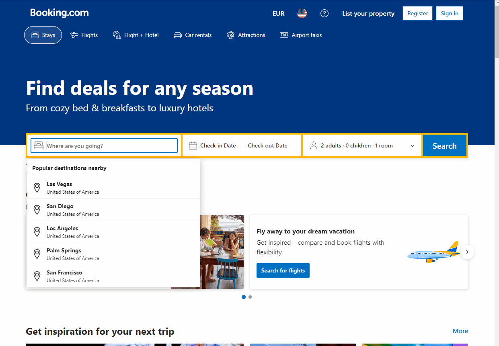
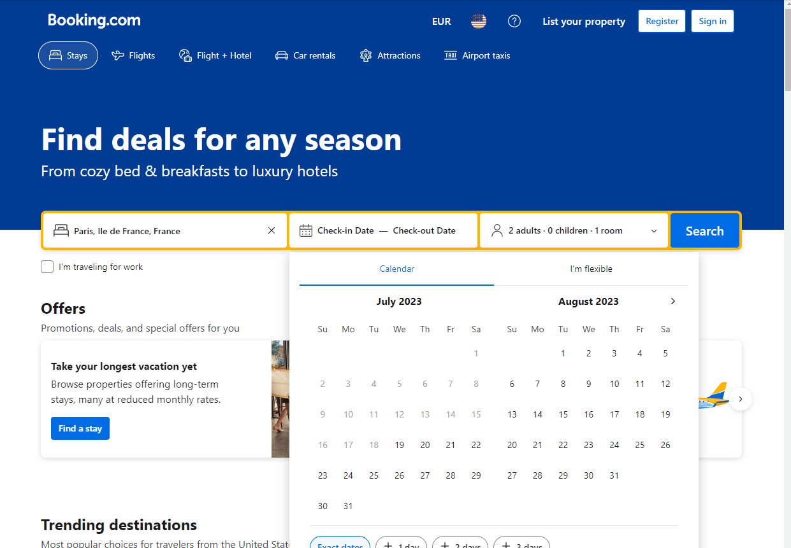

# Vacation Booking Automated Script 🤖

This is a Python program utilizing Selenium WebDriver to automate the process you would take in order to book a vacation on the Booking.com website. Following Object Oriented Programming principles the Booking class is created and instantiated [here](run.py) as "bot", multiple methods were then created and called on "bot"; methods found [here](booking/booking.py).

## Deal Searching Method Breakdown

---

### **.land_first_page()**

it should:

- open up the Booking.com website ☑️
- close the "Genius" popup ☑️

```python
    def land_first_page(self):
        # open URL
        self.get(const.BASE_URL)
        # close popup
        # make sure a presence of a popup is located
        if wait.until(
            EC.presence_of_element_located(
                # element filtration
                (By.CLASS_NAME, "[class_name]"),
            )
        ):
            # grab popup element close button when available
            closeBtn = self.find_element(
                By.CLASS_NAME,
                "[class_name]",
            )
            # close popup
            closeBtn.click()
```


---

### **.change_currency()**

it should:

- click on currency selection modal ☑️
- click on currency given in parameter ⛔
  - <span style="color:red">ERROR:</span> complied style sheets makes it difficult to filter currencies by name.
    - solved with try except block ☑️

```python
    # change website currency for universal
    def change_currency(self, currency):
        # grabbing currency element
        currencyElement = self.find_element(
            By.CSS_SELECTOR, '[css_selector]'
        )
        # click on currenct element
        currencyElement.click()
        # Selecting span by filtering out by span based on currency param
        currencyText = self.find_elements(By.CLASS_NAME, "[class_name]")
        # try and see if texts match
        try:
            # loop through currenecy text
            for text in currencyText:
                # if one matches our currency param
                if text.text == currency:
                    # click on that text
                    text.click()
        # if a double element is found after going stale continue program
        except:
            print("Second element located: continuing...")

```


---

### **.select_location()**

it should:

- Type in location given in the paramater ☑️
- Select the first result in the list ☑️

```python
    # select location
    def select_location(self, location):
        # find search field element
        searchField = self.find_element(By.NAME, "[name]")
        # clear it best practice
        searchField.clear()
        # send place
        searchField.send_keys(location)
        # wait for element generation before clicking on first item
        time.sleep(0.5)
        # grab the first result element
        firstResult = wait.until(
            EC.presence_of_element_located((By.CLASS_NAME, "[class_name]"))
        )
        # click on element
        firstResult.click()
```



---

### **.select_dates()**

it should:

- change the data value of check in element to parameter & select ☑️
- change the data value of check out element to parameter & select ☑️
  - edge case: needs pagination functionality for selecting months in advance 🚧

```python
# select dates
    def select_dates(self, check_in, check_out):
        # find check in element
        checkInEl = wait.until(
            # when present sent check in date value
            EC.presence_of_element_located(
                (By.CSS_SELECTOR, f'span[data-date="{check_in}"]')
            )
        )
        # click check in element
        checkInEl.click()
        # find check out element
        checkOutEl = wait.until(
            EC.presence_of_element_located(
                # when present sent check out date value
                (By.CSS_SELECTOR, f'span[data-date="{check_out}"]')
            )
        )
        # click check out element
        checkOutEl.click()
```



---

### **.select_occupants()**

it should:

- click on occupants selection modal ☑️
- click decrease button until adults count is 1 ☑️
- click increase count until adults == param count - 1 ☑️

```python
    # select occupants count
    def select_occupants(self, adults):
        # find selection element
        selectionTab = self.find_element(
            By.CSS_SELECTOR, '[css_selector]'
        )
        # click on selection element
        selectionTab.click()
        # find the adults section
        adultSelection = self.find_element(By.ID, "[id]")
        # decrease to starting point
        while True:
            # find decrease button
            decreaseBtn = self.find_element(
                By.CLASS_NAME,
                "[class_name]",
            )
            # click on decrease button
            decreaseBtn.click()
            countSpan = self.find_element(By.ID, "[id]")
            # gives elements adult count value
            adultsVal = countSpan.get_attribute("value")
            # if value of adults = 1, then break
            if int(adultsVal) == 1:
                break
        # wait before increasing to avoid hanging
        time.sleep(0.5)
        # find increase button element
        increaseBtn = self.find_element(
            By.XPATH,
            "[xpath]",
        )
        # increase param count minus 1
        for i in range(adults - 1):
            # click
            increaseBtn.click()
```


### **.click_search()**

it should:

- click the search button

```python
    # search deals
    def click_search(self):
        # find search button element
        searchBtn = self.find_element(
            By.CLASS_NAME,
            "[class_name]",
        )
        # click search button
        searchBtn.click()
```


